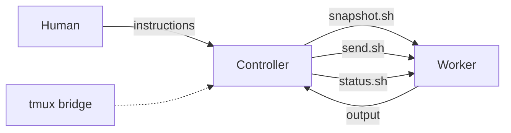
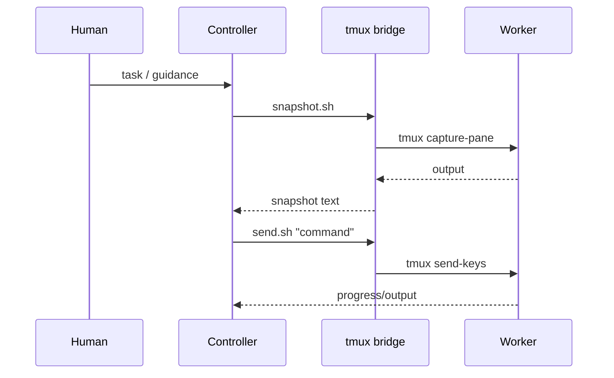

# MACS - Multi Agent Control System

| Pipeline | Status |
| --- | --- |
| Shellcheck |  |
| Smoke |  |

A tmux-based orchestration framework for controlling AI coding agents across multiple terminals. MACS separates **decision-making** (controller) from **execution** (worker) so you can keep oversight tight while shipping quickly.

## What MACS Gives You

- **Controller terminal** that supervises work, reads output, and decides next steps.
- **Worker terminal** that executes tasks and produces artifacts.
- **tmux bridge** scripts to snapshot output, send commands, and detect busy/idle state.
- **Optional bridge process** that can auto-route worker questions to the controller.

## Architecture





## Quick Start

### Prerequisites
- tmux
- Codex CLI (or Claude Code)
- Python 3.8+ (for `tools/tmux_bridge/bridge.py`)

### 1) Start a worker window
```bash
./tools/tmux_bridge/start_worker.sh macs
# start_worker auto-attaches by default; use --no-attach to skip
# start_worker auto-launches codex in a new worker pane:
#   CODEX_HOME="<repo>/.codex" codex --yolo
# use --no-codex to skip or --start-codex to force in an existing pane
# start_worker uses a repo-local tmux socket by default (./.codex/tmux.sock)
# start_worker enables tmux mouse + large scrollback by default
# use --no-mouse, --history-limit N, or --tmux-config PATH to override
```

### 2) Start Codex in the worker (if not auto-started)
```bash
CODEX_HOME="<repo>/.codex" codex --yolo
```

### 3) Start the controller in a separate terminal
From your project repo root:
```bash
../macs/tools/tmux_bridge/start_controller.sh
# If you copied the scripts into your repo:
# ./tools/tmux_bridge/start_controller.sh
# Or from anywhere:
# ../macs/tools/tmux_bridge/start_controller.sh --repo /path/to/your-repo
# Skip copying skills:
# ../macs/tools/tmux_bridge/start_controller.sh --skip-skills
# If tmux socket auto-detect fails:
# ../macs/tools/tmux_bridge/start_controller.sh --tmux-session macs
# ../macs/tools/tmux_bridge/start_controller.sh --tmux-socket /tmp/tmux-<uid>/default
# To bypass tmux detection (not recommended):
# ../macs/tools/tmux_bridge/start_controller.sh --no-tmux-detect
# If you don't pass a sandbox arg, start_controller.sh will prompt to add:
# --sandbox danger-full-access (needed for tmux sockets).
# You can also set MACS_CODEX_ARGS="--sandbox danger-full-access".
# To only install prompts/skills without launching Codex:
# ../macs/tools/tmux_bridge/start_controller.sh --no-codex
```
This writes:
- `.codex/macs-path.txt` so the controller can locate `tmux_bridge` tools.
- `.codex/tmux-socket.txt` and `.codex/tmux-session.txt` for auto-targeting.
- `.codex/tmux-bridge.sh` wrapper for cleaner command usage.

### 4) Use the controller wrapper
```bash
./.codex/tmux-bridge.sh snapshot
./.codex/tmux-bridge.sh send "your instruction"
./.codex/tmux-bridge.sh status
./.codex/tmux-bridge.sh set_target --pane %X
./.codex/tmux-bridge.sh notify &
```

### 5) Optional: start the auto-bridge
```bash
./tools/tmux_bridge/bridge.py --session macs
```
The bridge watches for worker requests and can auto-invoke the controller.

## How It Works

### Helper scripts
| Script | Purpose |
|--------|---------|
| `snapshot.sh` | Capture recent output from worker terminal |
| `send.sh` | Send text/commands to worker terminal |
| `status.sh` | Check if worker is busy (running) or idle |
| `set_target.sh` | Pin the worker pane for subsequent commands |
| `notify.sh` | Play a sound to alert the human |

### Controller workflow
1. **Snapshot** worker output.
2. **Decide** next instruction (controller owns reasoning).
3. **Send** a single, clear instruction to the worker.
4. **Wait** using the built-in backoff schedule.
5. **Repeat** until the task is complete or blocked.

## Configuration

### Environment variables
| Variable | Default | Description |
|----------|---------|-------------|
| `TARGET_PANE_LABEL` | `worker` | Label to search for when discovering panes |
| `TARGET_PANE_LINES` | `200` | Lines to capture in snapshots |
| `TARGET_PANE_BUSY_LINES` | `40` | Recent lines to check for busy indicator |
| `TARGET_PANE_SUBMIT_KEYS` | `Enter` | Keys to send after input |
| `TARGET_PANE_TYPE_DELAY_MS` | `400` | Delay after typing before submit |
| `TARGET_PANE_GUARD_BUSY` | `1` | Refuse to send if worker is busy |
| `TMUX_SOCKET` | (unset) | Optional tmux socket path for all scripts (`--socket` flag) |
| `MACS_CODEX_ARGS` | (unset) | Extra args to pass to `codex` from `start_controller.sh` |
| `MACS_CODEX_HOME` | (unset) | Override `CODEX_HOME` used by `start_worker.sh` |
| `MACS_TMUX_CONFIG` | (unset) | Path to `start_worker.sh` config file |
| `MACS_TMUX_MOUSE` | `on` | Default mouse setting for `start_worker.sh` |
| `MACS_TMUX_HISTORY_LIMIT` | `100000` | Default scrollback for `start_worker.sh` |

### Files created in your repo
- `.codex/prompts/controller.md` (controller system prompt)
- `.codex/skills/` (skills library)
- `.codex/macs-path.txt` (path to this MACS repo)
- `.codex/tmux-socket.txt` / `.codex/tmux-session.txt` (auto-targeting)
- `.codex/tmux-bridge.sh` (wrapper around tmux bridge scripts)

### Worker tmux defaults

`start_worker.sh` enables mouse mode and sets a large scrollback limit by default.
It also uses a repo-local tmux socket (`./.codex/tmux.sock`) by default so the controller can connect reliably.

Override in a config file:
`./.codex/tmux-worker.env` (project) or `~/.config/macs/tmux-worker.env` (global):
```bash
TMUX_MOUSE=off
TMUX_HISTORY_LIMIT=50000
TMUX_SOCKET=/path/to/worker.tmux.sock
```

Or override per-run:
```bash
./tools/tmux_bridge/start_worker.sh --no-mouse --history-limit 20000
# target a specific tmux server/socket if needed:
# ./tools/tmux_bridge/start_worker.sh --tmux-socket /tmp/tmux-<uid>/default
```

## Troubleshooting

### “Operation not permitted” when snapshotting
The Codex sandbox may not be able to access the tmux socket. If you didn't pass a sandbox arg, start_controller.sh will prompt to add:
```bash
--sandbox danger-full-access
```

### “Unable to find target pane”
Pin the worker pane explicitly:
```bash
./.codex/tmux-bridge.sh set_target --pane %3
```

### Worker appears busy when idle
Increase the busy detection window:
```bash
TARGET_PANE_BUSY_LINES=60 ./.codex/tmux-bridge.sh status
```

## Testing

Run the smoke test locally:
```bash
./tools/tmux_bridge/tests/smoke.sh
```

## CI Pipelines

- **Shellcheck**: static analysis on tmux bridge shell scripts
- **Smoke**: spins up a dedicated tmux server and runs the bridge smoke test

These are the same checks that back the status badges at the top of this README.

## Documentation

- [Getting Started](docs/getting-started.md) - Detailed setup guide
- [Architecture](docs/architecture.md) - How MACS works
- [Customization](docs/customization.md) - Adapting for your project

## License

MIT License - see [LICENSE](LICENSE) for details.
