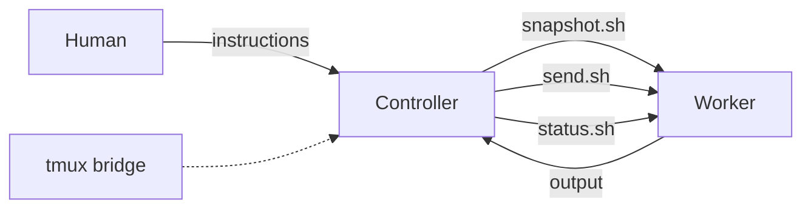
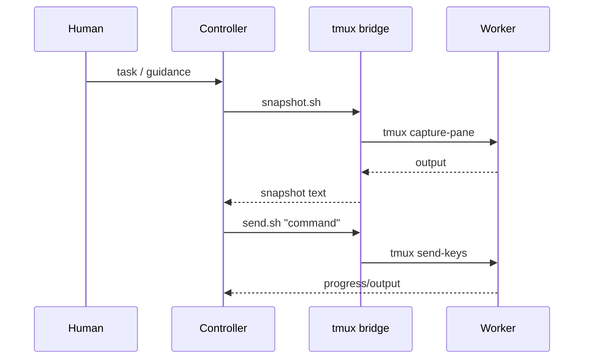

# MACS - Multi Agent Control System

| Pipeline | Status |
| --- | --- |
| Shellcheck |  |
| Smoke |  |

A tmux-based orchestration framework for controlling AI coding agents across multiple terminals. MACS separates **decision-making** (controller) from **execution** (worker) so you can keep oversight tight while shipping quickly.

## What MACS Gives You

- **Controller terminal** that supervises work, reads output, and decides next steps.
- **Worker terminal** that executes tasks and produces artifacts.
- **tmux bridge** scripts to snapshot output, send commands, and detect busy/idle state.
- **Optional bridge process** that can auto-route worker questions to the controller.
- **Repo-local orchestration bootstrap** under `.codex/orchestration/` with a single-controller lock.

## Architecture


```mermaid
flowchart LR
  H[Human] -->|instructions| C[Controller]
  C -->|snapshot.sh| W[Worker]
  C -->|send.sh| W
  C -->|status.sh| W
  B[tmux bridge] -.-> C
  W -->|output| C
```


```mermaid
sequenceDiagram
  participant H as Human
  participant C as Controller
  participant B as tmux bridge
  participant W as Worker
  H->>C: task / guidance
  C->>B: snapshot.sh
  B->>W: tmux capture-pane
  W-->>B: output
  B-->>C: snapshot text
  C->>B: send.sh "command"
  B->>W: tmux send-keys
  W-->>C: progress/output
```

## Quick Start

### Prerequisites
- tmux
- Codex CLI (or Claude Code)
- Python 3.8+ (for `tools/tmux_bridge/bridge.py`)

### 1) Start a worker window
From your project repo root:
```bash
../macs/start-worker.sh macs
# If you copied scripts into your repo:
# ./start-worker.sh macs
# start_worker auto-attaches by default; use --no-attach to skip
# start_worker auto-launches codex in a new worker pane:
#   CODEX_HOME="<repo>/.codex" codex --yolo
# use --no-codex to skip or --start-codex to force in an existing pane
# start_worker uses a repo-local tmux socket by default (./.codex/tmux.sock)
# start_worker enables tmux mouse + large scrollback by default
# use --no-mouse, --history-limit N, or --tmux-config PATH to override
```

### 2) Start Codex in the worker (if not auto-started)
```bash
CODEX_HOME="<repo>/.codex" codex --yolo
```

### 3) Start the controller in a separate terminal
From your project repo root:
```bash
../macs/start-controller.sh
# If you copied the scripts into your repo:
# ./start-controller.sh
# Or from anywhere:
# /path/to/macs/start-controller.sh --repo /path/to/your-repo
# Skip copying skills:
# ../macs/start-controller.sh --skip-skills
# If tmux socket auto-detect fails:
# ../macs/start-controller macs
# ../macs/start-controller.sh --tmux-session macs
# ../macs/start-controller.sh --tmux-socket /tmp/tmux-<uid>/default
# To bypass tmux detection (not recommended):
# ../macs/start-controller.sh --no-tmux-detect
# If you don't pass a sandbox arg, start_controller.sh will prompt to add:
# --sandbox danger-full-access (needed for tmux sockets).
# You can also set MACS_CODEX_ARGS="--sandbox danger-full-access".
# To only install prompts/skills without launching Codex:
# ../macs/start-controller.sh --no-codex
```
This writes:
- `.codex/macs-path.txt` so the controller can locate `tmux_bridge` tools.
- `.codex/tmux-socket.txt` and `.codex/tmux-session.txt` for auto-targeting.
- `.codex/tmux-bridge.sh` wrapper for cleaner command usage.
- `.codex/orchestration/` bootstrap state including `controller.lock`, `state.db`, and `events.ndjson`.
- Launches controller Codex with `CODEX_HOME="<repo>/.codex"` automatically.
- Acquires an exclusive repo-local controller lock before launching Codex.

### 4) Use the controller wrapper
```bash
./.codex/tmux-bridge.sh snapshot
./.codex/tmux-bridge.sh send "your instruction"
./.codex/tmux-bridge.sh status
./.codex/tmux-bridge.sh set_target --pane %X
./.codex/tmux-bridge.sh notify &
```

### 5) Optional: initialize orchestration state directly
```bash
./macs setup init
```

This creates or verifies `.codex/orchestration/`, including the repo-local controller lock, authoritative `state.db`, and append-friendly `events.ndjson`, without launching the controller. It also runs a startup recovery pass that restores persisted control-plane state, marks any prior live ownership for reconciliation, and reports whether new assignments should stay blocked until recovery is resolved.

It also bootstraps separate repo-local config domains:
- `.codex/orchestration/controller-defaults.json`
- `.codex/orchestration/adapter-settings.json`
- `.codex/orchestration/routing-policy.json`
- `.codex/orchestration/governance-policy.json`
- `.codex/orchestration/state-layout.json`

Inspect the active configuration without editing code paths directly:
```bash
./macs setup check
./macs setup check --json
```

`controller-defaults.json` owns controller-local defaults such as the default workflow class for `macs task create`. `adapter-settings.json` owns repo-local adapter enablement and config references. `state-layout.json` documents the control-plane store paths while preserving compatibility with bridge-era repo-local files such as `.codex/tmux-session.txt`, `.codex/tmux-socket.txt`, and `.codex/target-pane.txt`.

For existing single-worker users, `setup check` also doubles as the compatibility summary:
- no repo-local state migration is required
- single-worker mode remains supported as a one-worker specialization of the same control-plane model
- existing repo-local metadata remains readable, including `.codex/tmux-session.txt`, `.codex/tmux-socket.txt`, `.codex/target-pane.txt`, and the legacy `tools/tmux_bridge/target_pane.txt` fallback

Before registering workers, you can ask MACS for the conservative onboarding path it expects:
```bash
./macs setup dry-run
./macs setup dry-run --json
```

`setup dry-run` is read-only. It reports the controller-owned order for bootstrap, config inspection, worker discovery, worker registration, readiness validation, intervention, and recovery without mutating controller state on your behalf.

For migration, `setup dry-run` also calls out the boundary between what still works unchanged and what is now superseded by controller-owned commands.

For a mixed-runtime local-host setup, the normal flow is:
```bash
./macs setup init
./macs setup check --json
./macs worker discover --json
./macs worker register --worker <worker-id> --adapter codex --json
./macs worker register --worker <worker-id> --adapter local --json
./macs setup validate --json
```

`setup validate` reports a stable `PASS`, `PARTIAL`, `FAIL`, or `BLOCKED` adoption summary based on controller facts:
- repo-local bootstrap and config-domain visibility
- required local dependencies such as `python3` and `tmux`
- enabled adapter runtime availability on `PATH`
- registered and ready workers for the enabled adapters
- routing-default visibility

It does not auto-install runtimes or auto-register workers. Runtime binaries on `PATH` remain availability hints only; safe-ready-state is reached only when controller facts also show ready workers for the enabled adapters.

For the final Phase 1 readiness summary, run the same validation path in release-gate mode:
```bash
./macs setup validate --release-gate
./macs setup validate --release-gate --json
```

That invocation refreshes the release-evidence package under `_bmad-output/release-evidence/` and reports pass/fail status for setup readiness, adapter qualification, the mandatory failure matrix, restart recovery verification, and the four-worker reference dogfood scenario.

### 5a) Single-Worker Migration Boundary

Current single-worker supervision remains supported. You do not need a repo-local state migration step to move from older bridge-first habits to the control-plane commands.

Supported unchanged:
- `../macs/start-worker.sh macs` and `../macs/start-controller.sh`
- `./tools/tmux_bridge/snapshot.sh`
- `./tools/tmux_bridge/send.sh "<instruction>"`
- `./tools/tmux_bridge/status.sh`
- `./tools/tmux_bridge/set_target.sh --pane %X`

Superseded for normal orchestration work:
- manual task tracking in scrollback or pane notes
- ad hoc assignment decisions made outside controller state
- manual intervention or recovery bookkeeping outside `macs`

Use these controller-owned commands instead:
```bash
./macs task create --summary "Single-worker compatibility check"
./macs task assign --task <task-id> --worker <worker-id>
./macs task inspect --task <task-id>
./macs worker inspect --worker <worker-id> --open-pane
./macs task pause --task <task-id> --confirm
./macs recovery inspect --task <task-id>
```

One-worker mode is simply the same model with one registered worker. The same setup, discovery, registration, inspect, intervention, and recovery commands apply.

You can then discover and inspect tmux-backed workers through the control plane:
```bash
./macs worker discover --json
./macs worker list
./macs worker inspect --worker <worker-id> --json
./macs worker inspect --worker <worker-id> --open-pane
./macs adapter list
./macs adapter inspect --adapter codex
./macs adapter probe --worker <worker-id> --json
```

`--open-pane` keeps pane targeting on the controller-owned inspect surface. It pins the target through `tools/tmux_bridge/set_target.sh` and repo-local `.codex/target-pane.txt`, then reports `opened` when the current command can address the same tmux server or `pinned_only` with an explicit warning when it cannot.

Contributor note: adapter extension guidance now lives in [docs/adapter-contributor-guide.md](/home/codexuser/macs_dev/docs/adapter-contributor-guide.md). Use that guide with `./macs adapter inspect --adapter <adapter-id> --json` and `./macs adapter validate --adapter <adapter-id> --json` before treating runtime support as first-class.

### 5b) Use canonical task lifecycle commands

Normal task lifecycle work now stays on the `macs task` surface:

```bash
# Create with the contract-minimum input.
./macs task create --summary "Ship Story 4.2"

# Route by workflow policy.
./macs task assign --task <task-id> --workflow-class implementation --json

# Or pin an explicit worker.
./macs task assign --task <task-id> --worker <worker-id>

# Complete and archive through the same family.
./macs task close --task <task-id> --json
./macs task archive --task <task-id>
```

For task actions, `--json` responses use a stable action envelope with top-level `ok`, `command`, `timestamp`, `warnings`, `errors`, and action payloads under `data.result` and `data.event`.

Operational notes for the current lifecycle surface:
- A successful `task assign` now dispatches through the worker adapter, promotes the lease to `active`, and activates any reserved locks before returning.
- `task pause` moves an `active` task to `intervention_hold` and the same live lease to `paused` without minting a replacement lease or releasing protected-surface locks.
- `task resume` only restores an operator-paused task or lease pair back to `active`; invalid pause or resume requests return explicit contract conflicts.
- `task close` is the operator verb for canonical task state `completed`; it completes the live lease and releases held locks.
- `task archive` is only valid from terminal task states such as `completed`, `failed`, or `aborted`.
- When a runtime adapter does not advertise pause or resume depth yet, MACS keeps controller state authoritative and returns an explicit warning instead of pretending the runtime was fully paused.
- Action errors use stable exit codes: `4` for conflict or policy-blocked cases, `5` for degraded preconditions or still-unsupported verbs, and `6` when a worker side effect fails after the controller has rolled back to an explicit safe state.

Pause and resume now stay on the controller-owned command path:

```bash
./macs task pause --task <task-id> --json
./macs task resume --task <task-id> --json
./macs task inspect --task <task-id>
./macs lease inspect --lease <lease-id>
./macs recovery inspect --task <task-id>
./macs recovery retry --task <task-id> --confirm
./macs recovery reconcile --task <task-id> --confirm
./macs task reroute --task <task-id> --workflow-class implementation --json
./macs task abort --task <task-id> --json
```

`task reroute` and `task abort` remain intentionally guarded until the later recovery stories land. `task pause` and `task resume` now return the same stable action envelope as the other lifecycle verbs, including warnings when controller state moved but runtime pause depth is only best-effort or unavailable.

Accessibility note: human-readable pause, task inspect, and lease inspect output stays plain text and never depends on ANSI color. Under narrow terminals, or when `NO_COLOR=1` is set, those surfaces stack key fields vertically instead of relying on wide single-line layouts.

```bash
NO_COLOR=1 COLUMNS=80 ./macs task inspect --task <task-id>
```

Example narrow output:

```text
Task:
  task-123
State:
  intervention_hold
Current Lease:
  lease-123 (paused)
Intervention Basis:
  operator_pause
```

Compatibility note: the controller still accepts `macs task assign --task <task-id>` without a selector as a temporary brownfield fallback that reuses the stored task workflow class. Prefer the canonical documented forms with exactly one selector: `--worker` or `--workflow-class`.

### 6) Optional: start the auto-bridge
```bash
./tools/tmux_bridge/bridge.py --session macs
```
The bridge watches for worker requests and can auto-invoke the controller.

## How It Works

### Helper scripts
| Script | Purpose |
|--------|---------|
| `snapshot.sh` | Capture recent output from worker terminal |
| `send.sh` | Send text/commands to worker terminal |
| `status.sh` | Check if worker is busy (running) or idle |
| `set_target.sh` | Pin the worker pane for subsequent commands |
| `notify.sh` | Play a sound to alert the human |

`macs worker inspect --open-pane` and `macs task inspect --open-pane` reuse that same target-pin path before attempting a best-effort live tmux jump.

### Controller workflow
1. **Snapshot** worker output.
2. **Decide** next instruction (controller owns reasoning).
3. **Send** a single, clear instruction to the worker.
4. **Wait** using the built-in backoff schedule.
5. **Repeat** until the task is complete or blocked.

## Configuration

### Environment variables
| Variable | Default | Description |
|----------|---------|-------------|
| `TARGET_PANE_LABEL` | `worker` | Label to search for when discovering panes |
| `TARGET_PANE_LINES` | `200` | Lines to capture in snapshots |
| `TARGET_PANE_BUSY_LINES` | `40` | Recent lines to check for busy indicator |
| `TARGET_PANE_SUBMIT_KEYS` | `Enter` | Keys to send after input |
| `TARGET_PANE_TYPE_DELAY_MS` | `400` | Delay after typing before submit |
| `TARGET_PANE_GUARD_BUSY` | `1` | Refuse to send if worker is busy |
| `TMUX_SOCKET` | (unset) | Optional tmux socket path for all scripts (`--socket` flag) |
| `MACS_CODEX_ARGS` | (unset) | Extra args to pass to `codex` from `start_controller.sh` |
| `MACS_CODEX_HOME` | (unset) | Override `CODEX_HOME` used by `start_worker.sh` |
| `MACS_TMUX_CONFIG` | (unset) | Path to `start_worker.sh` config file |
| `MACS_TMUX_MOUSE` | `on` | Default mouse setting for `start_worker.sh` |
| `MACS_TMUX_HISTORY_LIMIT` | `100000` | Default scrollback for `start_worker.sh` |

### Files created in your repo
- `.codex/prompts/controller.md` (controller system prompt)
- `.codex/skills/` (skills library)
- `.codex/macs-path.txt` (path to this MACS repo)
- `.codex/tmux-socket.txt` / `.codex/tmux-session.txt` (auto-targeting)
- `.codex/target-pane.txt` (repo-local pinned worker pane)
- `.codex/tmux-bridge.sh` (wrapper around tmux bridge scripts)

### Worker tmux defaults

`start_worker.sh` enables mouse mode and sets a large scrollback limit by default.
It also uses a repo-local tmux socket (`./.codex/tmux.sock`) by default so the controller can connect reliably.

Override in a config file:
`./.codex/tmux-worker.env` (project) or `~/.config/macs/tmux-worker.env` (global):
```bash
TMUX_MOUSE=off
TMUX_HISTORY_LIMIT=50000
TMUX_SOCKET=/path/to/worker.tmux.sock
```

Or override per-run:
```bash
../macs/start-worker.sh --no-mouse --history-limit 20000
# If you copied scripts into your repo:
# ./start-worker.sh --no-mouse --history-limit 20000
# target a specific tmux server/socket if needed:
# ../macs/start-worker.sh --tmux-socket /tmp/tmux-<uid>/default
```

## Troubleshooting

### “Operation not permitted” when snapshotting
The Codex sandbox may not be able to access the tmux socket. If you didn't pass a sandbox arg, start_controller.sh will prompt to add:
```bash
--sandbox danger-full-access
```

### “Unable to find target pane”
Pin the worker pane explicitly:
```bash
./.codex/tmux-bridge.sh set_target --pane %3
```

### Worker appears busy when idle
Increase the busy detection window:
```bash
TARGET_PANE_BUSY_LINES=60 ./.codex/tmux-bridge.sh status
```

## Testing

Run the smoke test locally:
```bash
./tools/tmux_bridge/tests/smoke.sh
```

Run orchestration bootstrap tests:
```bash
python3 -m unittest discover -s tools/orchestration/tests
```

Run the dedicated four-worker reference dogfood suite:
```bash
python3 -m unittest tools.orchestration.tests.test_reference_dogfood_cli
```

Generate the RG4 dogfood evidence pack:
```bash
python3 -m tools.orchestration.dogfood
```

That run writes the human-readable report and machine-readable supporting artifacts under `_bmad-output/release-evidence/`.

Generate the aggregated Phase 1 release gate and evidence package:
```bash
./macs setup validate --release-gate
```

## CI Pipelines

- **Shellcheck**: static analysis on tmux bridge shell scripts
- **Smoke**: spins up a dedicated tmux server and runs the bridge smoke test

These are the same checks that back the status badges at the top of this README.

## Documentation

- [Getting Started](docs/getting-started.md) - Detailed setup guide
- [Architecture](docs/architecture.md) - How MACS works
- [Customization](docs/customization.md) - Adapting for your project

## License

MIT License - see [LICENSE](LICENSE) for details.
