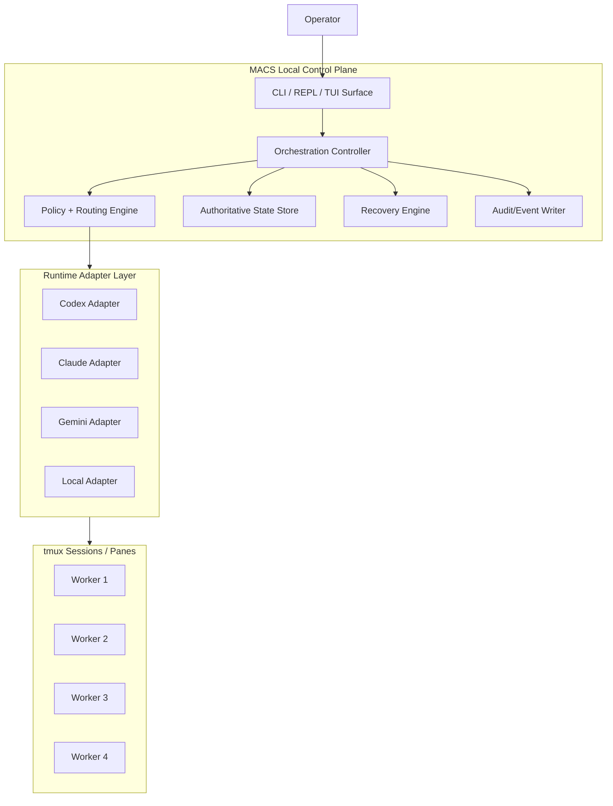
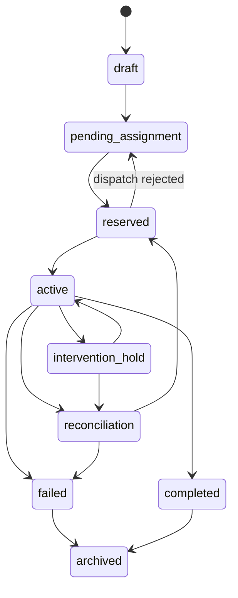
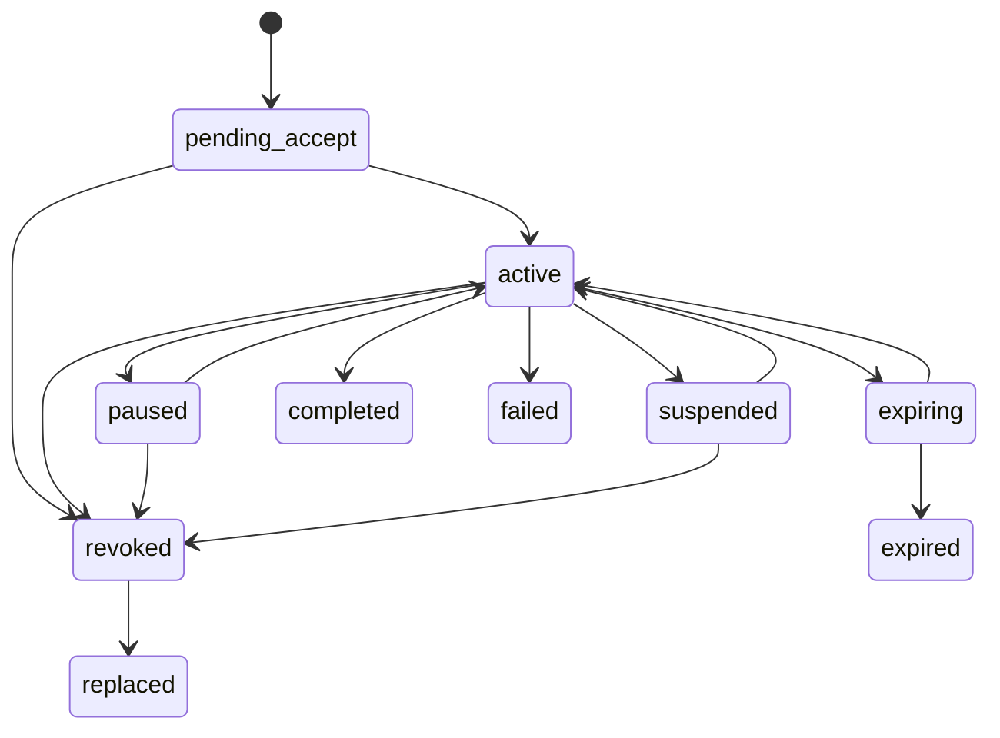

# MACS Phase 1 Architecture Decision Document

## Executive Summary

MACS Phase 1 evolves the current tmux bridge from a single-controller/single-worker supervision tool into a local-host-first orchestration control plane for heterogeneous agent runtimes. The controller owns authoritative state for `worker`, `task`, `lease`, `lock`, and `event`. Runtime adapters remain bounded evidence providers and execution bridges, not authority sources.

The architectural goal is not maximum automation. It is trustworthy orchestration under operator oversight. The system must keep ownership explicit, route work using controller policy plus adapter evidence, prevent unsafe concurrent work on protected surfaces, preserve an auditable history of interventions and recoveries, and recover cleanly from controller or worker failure without manufacturing false certainty.

This design intentionally stays close to the current MACS repo shape:

- shell-first operator workflows remain primary
- tmux remains the execution substrate
- Python stays acceptable for the controller core and adapters
- repo-local state remains under `.codex/`
- existing bridge helpers remain valid building blocks rather than being replaced by a hosted service or distributed scheduler

## Architecture Drivers

### Product Drivers

- One controller must govern multiple heterogeneous local workers.
- Operators must be able to inspect, assign, pause, abort, reroute, reconcile, and close work without normal-flow tmux surgery.
- Workflow-class-aware routing defaults must remain explainable and overridable.
- Auditability and failure containment are release-gating concerns, not polish.

### Technical Drivers

- Controller state must survive restart and support reconciliation on boot.
- The system must tolerate partial, stale, or missing runtime signals.
- Locking must start coarse and safe rather than clever and lossy.
- The architecture must be testable through explicit state transitions and deterministic contracts.

### Brownfield Drivers

- Preserve current launchers and `tools/tmux_bridge/` conventions.
- Preserve repo-local targeting metadata and `.codex/` state patterns.
- Default runtime in this repo remains Codex CLI, while Claude Code, Gemini CLI, and a local adapter become first-class workers.

## Architectural Principles

1. Controller authority first. Workers never become the source of truth for assignment, ownership, or recovery state.
2. Evidence over trust. Adapters report facts, soft signals, and claims with freshness metadata.
3. Zero-or-one active lease. A task may have zero active leases during reconciliation or interrupted reassignment, but never more than one.
4. Coarse locks before semantic locks. MVP protects repositories through conservative write-surface reservation.
5. Recovery reconciles; it does not assume atomic rewind.
6. Operator action stays inside MACS semantics. tmux is the substrate, not the canonical control interface.
7. State transitions must be explicit, durable, and testable.

## Scope and Non-Goals

### In Scope

- Single local-host controller process
- Multiple tmux-backed worker sessions
- Runtime adapter layer for Codex CLI, Claude Code, Gemini CLI, and one local/runtime-neutral adapter
- Durable controller-owned state store and audit log
- CLI/tmux-native operator experience
- Restart recovery and failure containment workflows
- Release-gated orchestration, adapter, and recovery tests

### Out of Scope

- Cross-machine orchestration
- Autonomous self-replanning outside operator-governed recovery
- Semantic merge intelligence beyond policy-defined protected surfaces
- Hosted control plane, enterprise IAM, or team administration
- Requiring identical telemetry depth from all runtimes

## System Context



## Logical Architecture

### Major Components

#### 1. Controller Core

Owns command handling, policy evaluation, task lifecycle transitions, intervention authorization, and recovery orchestration.

Primary responsibilities:

- validate commands against current authoritative state
- execute task, lease, and lock transitions atomically
- invoke adapters for dispatch or intervention side effects
- classify worker eligibility and degraded states
- emit durable audit events for every material transition

#### 2. Authoritative State Store

Local durable store for canonical orchestration entities and their indexes. This is the source of truth read by all operator views and used for restart recovery.

Primary responsibilities:

- persist `worker`, `task`, `lease`, `lock`, and `event` records
- enforce invariants such as one active lease per task
- support compare-and-swap style transitions for lock and lease mutation
- allow recovery-time replay and reconciliation

#### 3. Routing and Policy Engine

Computes worker eligibility and selection based on workflow class, required capabilities, governance policy, lock compatibility, freshness, health classification, and available runtime evidence.

Primary responsibilities:

- apply repo defaults and policy overrides
- rank eligible workers
- reject unsafe or under-qualified workers
- produce routing rationale for audit and operator inspection

#### 4. Runtime Adapter Layer

Normalizes mixed runtime behavior into one contract. Adapters may expose transport hooks, health probes, intervention hooks, and optional telemetry enrichments.

Primary responsibilities:

- discover or register runtime-backed workers
- dispatch controller-approved assignments into tmux-backed sessions
- report facts and evidence with timestamps and confidence
- perform supported interventions such as interrupt, pause, or capture

#### 5. Recovery and Reconciliation Engine

Handles degraded sessions, divergence after restart, interrupted reassignment, and split-brain containment.

Primary responsibilities:

- freeze unsafe progression
- reconcile persisted state with live runtime evidence
- move tasks into hold or reroute flows
- require explicit operator confirmation where decision rights demand it

#### 6. Operator Surface

CLI-first, tmux-aware interface that exposes controller truth, evidence, and actions. The controller pane remains the primary operating position.

Primary responsibilities:

- list and inspect workers, tasks, leases, locks, and events
- dispatch and intervene from one command path
- open the right worker pane when live context is needed
- provide compact human output and machine-readable output modes

## Physical Architecture

### Runtime Topology

- One MACS controller process per repo-local orchestration session
- One repo-local state directory under `.codex/orchestration/`
- One tmux server/socket per active workspace, preserving existing `.codex/tmux-socket.txt` and `.codex/tmux-session.txt` conventions
- Multiple worker panes or windows attached to that tmux server
- One adapter implementation per runtime type, with multiple worker instances permitted per adapter

### Suggested Storage Layout

```text
.codex/
  orchestration/
    controller.lock
    state.db
    events.ndjson
    snapshots/
    checkpoints/
    adapters/
      codex/
      claude/
      gemini/
      local/
```

Recommended implementation:

- `state.db`: SQLite for durable indexed authoritative state and invariant enforcement
- `events.ndjson`: append-friendly event export for debugging, replay tooling, and human inspection
- `snapshots/`: optional captured evidence, redacted by policy
- `checkpoints/`: recovery-time staging artifacts, not authority records

Rationale:

- SQLite fits local-host-first operation, transactional invariants, and brownfield simplicity.
- NDJSON gives cheap, portable audit export without forcing operators into SQL tooling.

## Authoritative Domain Model

### Entity Overview

#### Worker

Represents a governed execution endpoint backed by an adapter and a tmux session.

Required fields:

- `worker_id`
- `runtime_type`
- `adapter_id`
- `tmux_socket`
- `tmux_session`
- `tmux_pane`
- `state`: `registered | ready | busy | degraded | unavailable | quarantined | retired`
- `capabilities`
- `required_signal_status`
- `last_evidence_at`
- `last_heartbeat_at`
- `interruptibility`
- `operator_tags`

#### Task

Represents a controller-managed unit of work with scope, requirements, and lifecycle.

Required fields:

- `task_id`
- `title`
- `description`
- `workflow_class`
- `intent`
- `required_capabilities`
- `protected_surfaces`
- `priority`
- `state`: `draft | pending_assignment | reserved | active | intervention_hold | reconciliation | completed | failed | aborted | archived`
- `current_worker_id` nullable
- `current_lease_id` nullable
- `routing_policy_ref`

#### Lease

Represents a time-bounded ownership grant from controller to worker for one task.

Required fields:

- `lease_id`
- `task_id`
- `worker_id`
- `state`: `pending_accept | active | paused | suspended | expiring | revoked | expired | completed | failed | replaced`
- `issued_at`
- `accepted_at` nullable
- `ended_at` nullable
- `replacement_lease_id` nullable
- `intervention_reason` nullable
- `evidence_version`

Lease invariant:

- Exactly zero or one active lease per task.
- `active`, `paused`, `suspended`, and `expiring` are controller-recognized live lease states, but only one lease may be live at any time.
- A reroute or recovery flow must revoke or replace the live lease before activating a successor.

#### Lock

Represents a protected-surface reservation attached to a task and usually to its active lease.

Required fields:

- `lock_id`
- `target_type`: `file | directory | logical_surface`
- `target_ref`
- `mode`: `exclusive_write`
- `state`: `reserved | active | released | overridden | conflicted`
- `task_id`
- `lease_id`
- `policy_origin`
- `created_at`
- `released_at` nullable

Lock invariant:

- Concurrent write-impacting work on the same protected surface conflicts by default unless explicit policy says otherwise.

#### Event

Represents the durable explanation of something that happened.

Required fields:

- `event_id`
- `event_type`
- `aggregate_type`
- `aggregate_id`
- `timestamp`
- `actor_type`: `controller | operator | adapter | system`
- `actor_id`
- `correlation_id`
- `causation_id` nullable
- `payload`
- `redaction_level`

### State Authority Rules

- Worker runtime state is advisory until classified by the controller.
- Only the controller can change task state, lease state, lock state, or routing outcomes.
- Adapters can propose evidence and side-effect results; they cannot directly mutate authoritative records.
- tmux pane observations are evidence, not state transitions.

## State Machine Decisions

### Task State Machine



### Lease State Machine



Semantics:

- `paused`: operator-held, intentional stop; lease remains live and blocks replacement unless revoked.
- `suspended`: controller-held freeze because risk is unresolved; no further worker progress is assumed valid.
- `expiring`: warning state driven by weak freshness, health, or budget evidence.
- `revoked`: controller withdrew authority; worker may still be alive, but any further output is not trusted as active task ownership.
- `replaced`: historical marker showing a successor lease superseded it.

### Worker Health Classification

Controller-owned classification:

- `ready`: routable and sufficiently fresh
- `busy`: healthy but currently executing
- `degraded`: routable only if policy explicitly permits; normally drained from new work
- `unavailable`: not routable; session missing or dispatch impossible
- `quarantined`: intentionally excluded because adapter trust or recovery risk is unresolved

Classification inputs:

- heartbeat freshness
- adapter self-health
- dispatch ack behavior
- interruptibility support
- quota or session warnings where available
- pane-level evidence such as busy markers or stalled output

## Locking and Protected Surface Model

### MVP Lock Targets

- File path
- Directory path
- Logical work surface defined in policy, for example `docs/architecture`, `backend/api`, or `release-notes`

### MVP Conflict Rules

- Exclusive write locks are the default and only mandatory lock mode in MVP.
- A task may reserve multiple surfaces.
- Overlapping directory and file locks conflict if either implies write impact.
- Logical-surface locks conflict with any path lock mapped to that logical surface.
- Operator overrides are allowed only through explicit controller commands and always create override events plus reconciliation state.

### Rationale

This model is intentionally conservative. It protects correctness before throughput and gives the test suite crisp invariants. Finer semantic coordination can layer on later without weakening the Phase 1 authority model.

## Routing and Workflow-Class Defaults

### Routing Inputs

- workflow class
- required capabilities
- explicit runtime or worker pinning
- worker health classification and freshness
- current lock conflicts
- governance constraints
- token/session signals where available
- operator or repo policy overrides

### Workflow Classes

Phase 1 policy must distinguish at least:

- `documentation_context`
- `planning_docs`
- `solutioning`
- `implementation`
- `review`
- `privacy_sensitive_offline`

### BMAD Execution Policy

Operator-facing BMAD phases map onto the canonical workflow classes and runtime-order rules below:

| BMAD phase | Canonical `workflow_class` | `primary_plus_fallback` | `full_hybrid` | Additional guard |
| --- | --- | --- | --- | --- |
| Context capture / repo familiarization | `documentation_context` | `codex -> claude` | `codex -> claude` | drain degraded, unavailable, and quarantined workers |
| Planning artifacts / PRD / story shaping | `planning_docs` | `claude -> codex` | `claude -> codex -> gemini` | preserve planning rationale in routing decision |
| Solution design / architecture | `solutioning` | `claude -> codex` | `claude -> codex -> gemini` | hybrid profile broadens alternative exploration only |
| Implementation / development | `implementation` | `codex -> claude` | `codex -> claude -> local` | worker must be interruptible |
| Review / QA / release review | `review` | `codex -> claude` | `codex -> claude -> gemini` | review checkpoints and operator approvals stay explicit |
| Privacy-sensitive / offline work | `privacy_sensitive_offline` | `local only` | `local only` | forbid networked tools unless policy explicitly relaxes it |

### Default Policy Shape

```json
{
  "policy_version": "phase1-defaults-v1",
  "workflow_defaults": {
    "documentation_context": {
      "preferred_runtimes": ["codex", "claude"],
      "disallowed_states": ["degraded", "unavailable", "quarantined"]
    },
    "planning_docs": {
      "preferred_runtimes": ["claude", "codex", "gemini"]
    },
    "solutioning": {
      "preferred_runtimes": ["claude", "codex", "gemini"]
    },
    "implementation": {
      "preferred_runtimes": ["codex", "claude", "local"],
      "require_interruptibility": true
    },
    "review": {
      "preferred_runtimes": ["codex", "claude", "gemini"]
    },
    "privacy_sensitive_offline": {
      "preferred_runtimes": ["local"],
      "forbid_networked_tools": true
    }
  }
}
```

### Repository Default Decisions

- Default controller runtime in this repo: `Codex CLI`
- Default implementation worker preference in this repo: `Codex CLI`, then `Claude Code`
- Default privacy-sensitive routing: local/runtime-neutral adapter only unless operator overrides policy
- Gemini is first-class but initially more likely to serve planning, review, and alternative-solution paths than the default implementation path

### Operating Profiles

`primary_plus_fallback` is the shipping-default scope-control profile. It keeps one primary runtime and one fallback runtime per BMAD phase, with `privacy_sensitive_offline` pinned to `local` only.

`full_hybrid` is an explicit opt-in profile that uses the full ranked runtime lists in `routing-policy.json`:

- `documentation_context`: `codex -> claude`
- `planning_docs`: `claude -> codex -> gemini`
- `solutioning`: `claude -> codex -> gemini`
- `implementation`: `codex -> claude -> local`
- `review`: `codex -> claude -> gemini`
- `privacy_sensitive_offline`: `local`

Profiles do not relax the safety baseline. They only change candidate breadth. No profile may bypass controller authority, operator-confirmed actions, governed-surface controls, or audit requirements.

### Routing Outcome Contract

Every assignment decision must persist:

- ranked candidate list
- selected worker
- rejection reasons for ineligible workers
- evidence snapshot references
- `policy_version` plus `policy_path`
- `governance_policy_version` plus `governance_policy_path`
- lock check result
- enough rejected-worker detail to derive operator-visible blocking conditions and next actions when no worker is eligible
- operator override context if present

## Runtime Adapter Architecture

### Adapter Contract

Every adapter implements a controller-facing contract with three categories: required facts, required operations, and optional enrichments.

#### Required Facts

- stable worker identity
- runtime type
- tmux location
- capability declaration
- last-known freshness timestamp
- interruptibility support declaration
- degraded-mode declaration when a signal is absent

#### Required Operations

- `discover_workers()`
- `probe(worker_id)`
- `dispatch(worker_id, assignment_payload)`
- `capture(worker_id, lines_or_cursor)`
- `interrupt(worker_id)` or explicit unsupported response
- `acknowledge_delivery(worker_id, correlation_id)`

#### Optional Enrichments

- token or session budget details
- richer health telemetry
- runtime-native checkpoint hints
- structured task progress hints
- richer intervention support such as pause/resume

### Evidence Envelope

All adapter outputs normalize into a common envelope:

```json
{
  "adapter_id": "codex",
  "worker_id": "worker-codex-1",
  "observed_at": "2026-04-09T19:00:00+01:00",
  "kind": "fact|signal|claim",
  "name": "heartbeat|quota_warning|delivery_ack|capability_decl",
  "value": {},
  "freshness_seconds": 4,
  "confidence": "high|medium|low",
  "source_ref": "tmux:capture:%12"
}
```

Normalization rules:

- Facts are directly observed, such as successful tmux pane presence or delivery ack.
- Signals are interpreted but bounded, such as stale heartbeat or budget warning.
- Claims are runtime self-reports that lack independent corroboration.

### First-Class Adapter Qualification

A runtime adapter is first-class in Phase 1 only when it:

- satisfies all required facts and operations
- declares unsupported features explicitly rather than omitting them silently
- implements degraded-mode behavior for missing telemetry
- supports at least one controller-mediated intervention path
- emits enough evidence for safe worker eligibility decisions
- passes adapter contract tests and mandatory failure-mode coverage for supported features

## CLI and tmux-Native Operator Surface

### Surface Model

The operator experience is a hybrid CLI plus tmux workspace:

- CLI commands and inspector views are the canonical authority surface
- tmux panes are live execution contexts reachable from CLI references
- normal operations never require raw pane archaeology

### Command Families

- `macs worker list|inspect|register|disable|quarantine`
- `macs task create|assign|inspect|pause|resume|reroute|abort|close|archive`
- `macs lease inspect|history`
- `macs lock list|inspect|override|release`
- `macs event tail|inspect|export`
- `macs adapter validate|probe`
- `macs recovery inspect|reconcile|retry`

### UX Backing Requirements

- summaries show controller truth first, then adapter evidence
- degraded or missing signals are labeled explicitly
- every task view shows current owner, current lease, lock summary, and recent events
- every worker view shows routability, freshness, interruptibility, and adapter support depth
- any item can link or jump to its tmux pane when live inspection is needed
- commands support `--json` for automation and tests

### Why Hybrid CLI/TUI Instead of Web

- matches existing repo practices and operator expectations
- works over SSH and inside tmux-native workflows
- keeps controller authority visible in the same environment as worker execution
- reduces delivery risk versus a parallel web surface

## Persistence and Audit Architecture

### Persistence Strategy

Authoritative records live in SQLite with transactional writes. Audit events are stored both in SQLite and in append-only NDJSON export for operational inspection and replay tooling.

Recommended tables:

- `workers`
- `tasks`
- `leases`
- `locks`
- `events`
- `routing_decisions`
- `evidence_records`
- `recovery_runs`
- `policy_snapshots`

### Event Record Schema

The canonical event record persisted to `events` and mirrored to `events.ndjson` is:

- `event_id`
- `event_type`
- `aggregate_type`
- `aggregate_id`
- `timestamp`
- `actor_type`
- `actor_id`
- `correlation_id`
- `causation_id`
- `payload`
- `redaction_level`

`redaction_level` is `none`, `redacted`, or `omitted`.

Common payload fragments:

- `affected_refs`: task, lease, worker, lock, or recovery-run refs touched by the action
- `decision_action`, `decision_class`, `decision_event_id`, `intervention_rationale`
- `routing_decision_id`, `selected_worker_id`, `policy_version`, `governance_policy_version`
- `audit_content`: per-content status for `prompt_content`, `terminal_snapshot`, and `tool_output`
- event-specific facts such as previous/next worker state, lock conflict detail, or startup recovery summary

Event families in Phase 1:

- task lifecycle: `task.created`, `task.assigned`, `task.activated`, `task.paused`, `task.resumed`, `task.rerouted`, `task.completed`, `task.assignment_failed`, `task.archived`
- lease lifecycle: `lease.activated`, `lease.paused`, `lease.resumed`, `lease.revoked`, `lease.replaced`, `lease.completed`, `lease.suspended`
- lock lifecycle: `lock.reserved`, `lock.activated`, `lock.released`
- worker governance: `worker.discovery_refreshed`, `worker.registered`, `worker.enabled`, `worker.disabled`, `worker.quarantined`, `worker.health_reclassified`
- routing and recovery: `routing.decision_recorded`, `intervention.decision_recorded`, `recovery.retry_requested`, `recovery.reconciled`, `controller.startup_recovery_completed`

### Supporting Evidence Records

Phase 1 uses three supporting evidence tables in addition to canonical events:

- `routing_decisions`: `decision_id`, `task_id`, `selected_worker_id`, `rationale`, `evidence_ref`, `created_at`
- `recovery_runs`: `recovery_run_id`, `task_id`, `state`, `started_at`, `ended_at`, `anomaly_summary`, `decision_summary`
- `policy_snapshots`: `snapshot_id`, `policy_origin`, `policy_version`, `captured_at`, `payload`

### Write Model

Each controller action follows this pattern:

1. Read current authoritative state.
2. Validate invariants and policy.
3. Write entity mutations and event records in one transaction.
4. Trigger adapter side effect.
5. Persist side-effect result as evidence plus follow-up events.
6. If side effect fails, transition task or worker into an explicit safe state rather than rolling back history invisibly.

This preserves durable intent and outcome rather than pretending runtime side effects are atomically reversible.

### Audit Content Policy

Persist by default:

- entity IDs and timestamps
- actor identity
- state transitions
- routing rationale and rejection reasons
- intervention rationale
- evidence metadata and references

Persist optionally by policy:

- prompt content
- terminal snapshots
- tool outputs

Controls:

- policy-based redaction
- explicit `retain | redact | omit` mode per rich-content class
- bounded retention windows for rich content
- longer retention for minimal event metadata
- local-host storage by default

## Restart Recovery and Reconciliation

### Restart Assumptions

- Controller process may crash while workers remain alive.
- tmux server may persist while controller state may be older than live runtime conditions.
- Workers may continue producing output after controller authority has been interrupted.
- External tool side effects cannot be rewound automatically.

### Boot Sequence

1. Acquire single-controller session lock.
2. Load persisted authoritative state.
3. Restore indexes and identify any live leases or unreleased locks.
4. Probe adapters and tmux for live worker/session evidence.
5. Compare persisted live state with current evidence.
6. Mark any uncertain task or lease as `intervention_hold` or `reconciliation`.
7. Prevent new assignments until all uncertain live ownership is classified.
8. Present a recovery summary to the operator.

### Reconciliation Rules

- If persisted active lease maps to a live healthy worker and evidence is fresh, controller may reaffirm ownership.
- If persisted active lease maps to missing or degraded worker, task enters `reconciliation`.
- If two workers appear to claim or continue the same task, both are treated as unsafe until operator-mediated reconciliation completes.
- Locks linked to uncertain leases remain held until resolved or explicitly overridden.
- No automatic reassignment is allowed when ownership ambiguity exists unless policy explicitly classifies the condition as safe and operator visibility requirements are satisfied.

### Recovery Outputs

Each recovery run produces:

- recovery run record
- detected anomalies
- evidence references
- recommended actions
- operator decisions
- resulting task, lease, and lock transitions

## Failure Containment Model

### Mandatory Failure Classes

- worker disconnect
- stale lease/session divergence
- duplicate task claim
- split-brain ownership
- lock collision
- misleading health evidence
- surfaced budget/session exhaustion
- interrupted recovery

### Containment Decisions

#### Split-Brain

- Freeze affected tasks immediately.
- Mark live leases as suspended or revoked according to evidence quality.
- Quarantine workers involved if trust remains unresolved.
- Require reconciliation before further routing on affected surfaces.

#### Lock Collision

- Reject conflicting assignment before dispatch when detected pre-flight.
- If detected post-dispatch, freeze progression and move task to reconciliation.
- Preserve both lock histories and the evidence that exposed the conflict.

#### Misleading Health Evidence

- Drain worker from new assignments.
- Downgrade confidence and freshness.
- Require corroboration before returning the worker to ready state.

#### Budget/Session Exhaustion

- Raise operator-visible warning.
- Stop assigning new work to the affected worker.
- Recommend checkpoint, closeout, or reroute depending on task state and adapter capability.

#### Interrupted Recovery

- Recovery steps are themselves evented and resumable.
- Successor lease activation must not occur until predecessor live lease is clearly revoked or reconciled.

## Security and Governance Boundaries

### Decision Rights Model

#### Automatic

- worker discovery refresh
- health reclassification from fresh or stale evidence
- draining degraded workers from new routing
- creation of warning events
- startup recovery summary generation

#### Policy-Automatic but Operator-Visible

- `task.assign`
- candidate ranking and worker eligibility filtering
- lock reservation during assignment
- `worker.disable` and `worker.quarantine` drain behavior
- transition to `expiring` or `intervention_hold` from degraded evidence

#### Operator-Confirmed and Implemented in Phase 1

- `task.pause`
- `task.resume`
- reroute to a new worker after degradation
- `recovery.retry`
- `recovery.reconcile`

#### Operator-Confirmed but Guarded in Phase 1

- `task.abort`
- lock override
- release of uncertain locks
- any action that changes ownership during unresolved ambiguity outside the implemented reroute and recovery flows

#### Forbidden in MVP

- `governance.auto_push`
- `governance.remote_operation`
- silent ownership transfer
- automatic push or deployment side effects
- adapter-driven authority mutation

### Product Safety Policies

- `POL-1 No Auto Push`: controller defaults and shipped profiles may not publish code, merge changes, or push remotes automatically.
- `POL-2 No Autonomous Remote Ops`: remote execution or external write-side effects require explicit governed-surface policy and operator confirmation; privacy-sensitive/offline work forbids them by default.
- `POL-3 Baseline Diff/Review Gate`: close/archive and any safety-relaxing action require an operator-visible diff/review checkpoint plus an attributable decision event.
- `POL-4 Explicit Approval Classes`: automatic, policy-automatic, operator-confirmed, guarded, and forbidden actions are part of the product contract rather than hidden command behavior.
- `POL-5 Governed Surface Control`: MCP and similar tool surfaces are deny-by-default unless allowlisted, pinned to approved adapters where required, and auditable in routing decisions.

### Trust Boundaries

| Boundary | Default stance | Required control |
| --- | --- | --- |
| Runtime adapter | semi-trusted evidence provider | qualification gate, unsupported-feature declarations, governed-surface declaration, repo-local enable/disable control |
| Worker runtime | execution environment, never authority peer | controller-owned ownership, routing, and recovery state; adapter evidence stays bounded as fact, signal, or claim |
| MCP and tool surfaces | deny by default | governance allowlist, adapter pin where required, explicit routing rejection reason when blocked |
| Networked remote mutation | forbidden by default for autonomous use | operator confirmation plus governed-surface policy; always forbidden for silent execution |
| Secrets | outside authoritative audit payloads by default | scoped secret refs only, bound to adapter/workflow/surface; no raw secret values in controller events |

Current Phase 1 implementation already ships `allowlisted_surfaces`, `pinned_surfaces`, workflow overrides, and audit-content policy through `governance-policy.json`. This correction pass reserves three additional first-class governance controls for production-oriented profiles:

- `operating_profile`
- `surface_version_pins`
- `secret_scopes`

## Implementation Architecture

### Recommended Module Shape

```text
tools/orchestration/
  controller.py
  state_store.py
  router.py
  recovery.py
  policy.py
  events.py
  adapters/
    base.py
    codex.py
    claude.py
    gemini.py
    local.py
  cli/
    main.py
    formatters.py
    inspectors.py
tools/tmux_bridge/
  snapshot.sh
  send.sh
  status.sh
  set_target.sh
  notify.sh
```

Design notes:

- Reuse `tools/tmux_bridge/` for low-level pane operations.
- Keep orchestration state logic separate from transport helpers.
- Prefer Python stdlib plus SQLite for the controller core in Phase 1.
- Keep root launchers thin and compatible with existing setup flows.

### Compatibility Plan

- Existing single-controller/single-worker flows remain supported as a degenerate one-worker orchestration session.
- Legacy `.codex/target-pane.txt` and `tools/tmux_bridge/target_pane.txt` remain readable during migration.
- Existing snapshot/send/status helpers remain usable directly.
- New orchestration commands layer above existing helpers instead of replacing them immediately.

## Test Architecture

### Testing Principles

- Test explicit state transitions, not only command output.
- Treat failure containment as a first-class test target.
- Separate deterministic controller tests from tmux-backed integration tests.
- Validate degraded-mode behavior per adapter, not just happy-path dispatch.

### Test Layers

#### 1. Unit Tests

Scope:

- task/lease/lock transition rules
- routing policy evaluation
- worker classification logic
- persistence invariants
- recovery decision logic

Examples:

- task cannot hold two active leases
- revoked predecessor lease required before successor activation
- degraded worker excluded from implementation routing by default

#### 2. Contract Tests

Scope:

- base adapter contract conformance
- evidence envelope normalization
- unsupported-feature declarations
- first-class qualification checks

Each adapter must pass the same shared contract suite with runtime-specific fixtures.

#### 3. Integration Tests

Scope:

- controller plus SQLite store plus adapter stubs
- tmux session discovery
- assignment to worker pane
- pause, interrupt, reroute, and recovery flows

These should extend the current smoke-test approach with dedicated temporary tmux sockets and cleanup traps.

#### 4. Failure Drill Tests

Release-gated scenarios:

- worker disappears after lease activation
- stale heartbeat with still-live pane
- duplicate task dispatch attempt
- conflicting lock acquisition
- misleading healthy signal from adapter
- partial recovery followed by restart
- quota exhaustion where runtime exposes it

#### 5. End-to-End Dogfood Scenarios

Scope:

- 4-worker local-host session in this repo
- mixed-runtime routing according to workflow classes
- operator intervention without raw tmux surgery
- restart recovery with existing live sessions

### Test Harness Design

- use isolated tmux sockets
- use fixture repositories or fixture work surfaces
- make time and freshness thresholds injectable for deterministic tests
- store event traces for assertions
- support `--json` operator output for black-box validation

### Release Gate Matrix

Phase 1 release requires:

- full pass on mandatory failure classes
- adapter contract pass for all four first-class adapters
- successful 4-worker reference scenario
- verification that restart recovery preserves zero-or-one active lease invariants

### Operational Metrics

| Metric | Definition | Target | Evidence source |
| --- | --- | --- | --- |
| conflict_prevention_rate | detected conflicting write-impacting assignment attempts blocked before dispatch | 100% in passing drills; 0 silent conflicting assignments in passing release-gate runs | failure-mode matrix, routing decisions, lock events |
| stale_lease_recovery_visibility_seconds | time from stale/ambiguous live-lease detection to operator-visible hold or reconciliation | <= 60s in reference environment | startup recovery report, recovery events, warning timeline |
| reroute_success_rate | successful operator-confirmed reroutes divided by reroute attempts | >= 90% in controlled recovery drills; 100% preserve causation chain on success | `task.rerouted`, `lease.replaced`, and recovery-run evidence |
| intervention_frequency | unplanned operator-confirmed interventions divided by total tasks in the default profile | < 10% excluding planned drills and demonstrations | dogfood summary plus intervention events |
| false_safe_routing_incidents | assignments later frozen as unsafe without a contemporaneous warning, policy block, or recovery hold | 0 in any passing release-gate run | failure drills, dogfood evidence, event audit |
| auditable_passing_run_rate | PASS runs that include complete report, JSON summary, and correlated event IDs | 100% | release-gate summary and evidence package |

## Architecture Validation Results

### Coherence Validation

The design is coherent with the accepted product brief, PRD, UX spec, and project context. It keeps tmux and repo-local shell workflows as the execution substrate while moving orchestration authority into a durable controller core. The chosen stack and module boundaries fit brownfield constraints and avoid introducing hosted infrastructure or unnecessary third-party dependencies.

### Requirements Coverage Validation

The architecture directly covers controller-owned lifecycle state, routing and policy, protected-surface locks, intervention and recovery, auditability, workflow-class-aware defaults, adapter extensibility, and local-host-first deployment. The elicitation-note gaps around lease semantics, lock granularity, persistence, operator-surface definition, adapter qualification, decision rights, and audit bounds are all resolved explicitly here.

### Implementation Readiness

The implementation path is concrete enough for story decomposition:

- stable authoritative entities and state machines are defined
- module boundaries are clear
- persistence and recovery strategy are selected
- adapter contract and first-class criteria are explicit
- test layers and release gates are specified

### Residual Risks

- Runtime adapters will still vary materially in telemetry depth; controller defaults must remain conservative.
- Recovery semantics depend on good operator discipline when runtime side effects escape the controller boundary.
- Lock granularity may create throughput tradeoffs until post-MVP refinements are added.

### Readiness Assessment

Overall status: READY FOR IMPLEMENTATION
