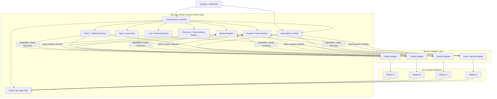
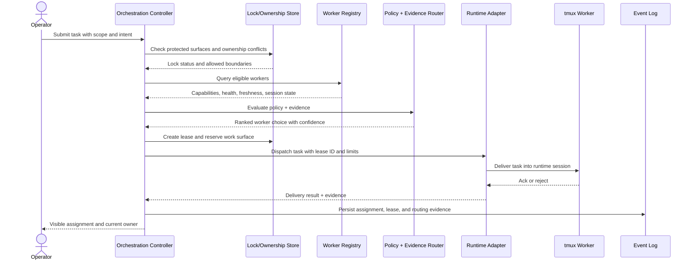
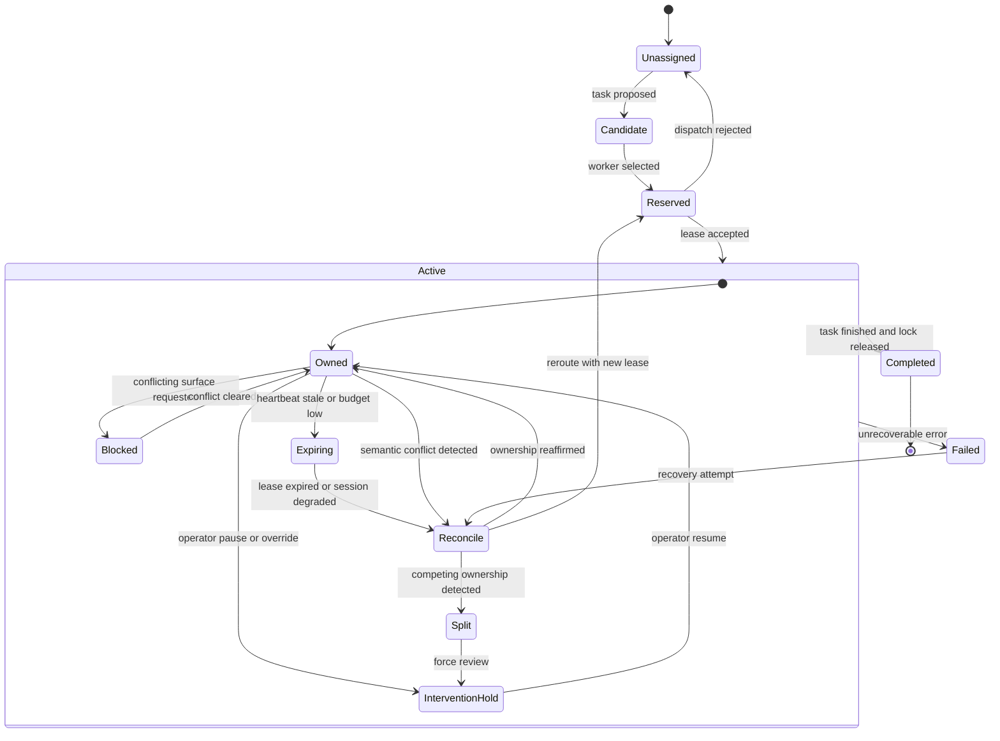
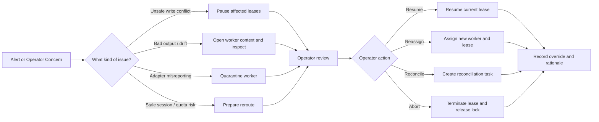
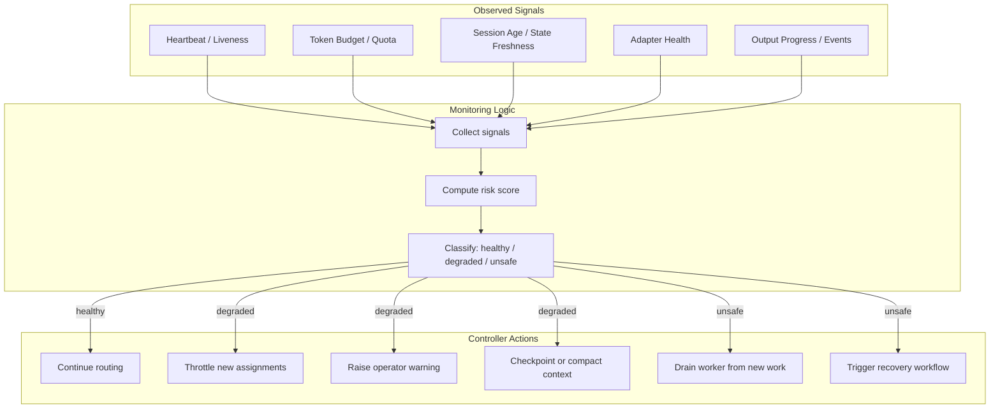
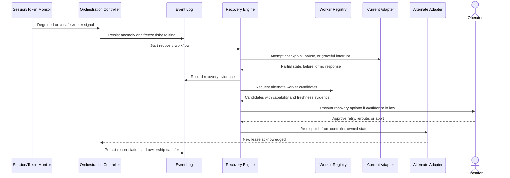

# MACS Multi-Agent Orchestration Diagram Pack

**Date:** 2026-04-09  
**Purpose:** Mermaid architecture/orchestration diagram pack for the MACS multi-agent orchestration proposal  
**Grounded In:**  
- `/home/codexuser/macs_dev/_bmad-output/planning-artifacts/product-brief-macs_dev.md`
- `/home/codexuser/macs_dev/_bmad-output/planning-artifacts/research/domain-multi-agent-orchestration-and-agent-runtime-orchestration-for-macs-research-2026-04-09.md`

## Scope

This pack visualizes the proposed MACS control plane with emphasis on:

- controller-owned authority
- worker registry and capability evidence
- pluggable runtime adapters
- locks, ownership, and coordination boundaries
- operator intervention paths
- token/session monitoring
- recovery and reconciliation loops

## Diagram 1: Control Plane Overview

**Interpretation:** The controller remains authoritative for routing, lease state, locks, interventions, and recovery. Adapters expose evidence and control hooks, but they do not become the source of truth.

## Diagram 2: Task Dispatch and Evidence-Backed Routing

**Interpretation:** Routing is not a blind "send to any idle worker" step. It is gated by lock state, worker evidence, and explicit lease creation before the task enters a runtime session.

## Diagram 3: Ownership, Locks, and Safe Parallelisation

**Interpretation:** Safe parallelisation depends on explicit state transitions, not informal etiquette between workers. The critical failure to contain is split-brain ownership over the same protected surface.

## Diagram 4: Intervention and Operator Control Paths

**Interpretation:** Intervention is a first-class orchestration feature. The operator is not outside the system; the operator acts through explicit pause, resume, reroute, reconcile, and abort controls that are logged.

## Diagram 5: Session and Token Monitoring Loop

**Interpretation:** Monitoring is operational, not cosmetic. Token exhaustion, stale sessions, and weak adapter health become scheduling and recovery inputs before they become silent failures.

## Diagram 6: Recovery and Reconciliation Loop

**Interpretation:** Recovery uses controller-owned state and evidence from the event log, not optimistic assumptions that the failing runtime can fully restore itself. Human approval remains available when confidence is weak.

## Design Notes

- The control plane owns truth for `worker`, `task`, `lease`, `lock`, `event`, `override`, and `reconciliation` state.
- Runtime adapters are intentionally bounded. They expose facts, signals, and claims with freshness and confidence, but policy semantics stay in MACS.
- Locks should begin coarse, around protected surfaces such as file sets, branches, or task scopes, before moving to finer semantic coordination.
- Intervention paths should be auditable by default so pause, reroute, and abort decisions are replayable in failure reviews.
- Recovery should assume external side effects are not atomically reversible. Reconciliation is therefore mandatory after degraded sessions or competing ownership claims.

## Mapping Back to Source Artifacts

- The brief establishes controller-owned authority over routing, ownership, leases, locks, intervention, and recovery.
- The brief also defines worker registry, pluggable adapters, operator monitoring, token/session visibility, and automated orchestration tests as first-release scope.
- The research report reinforces control-plane versus execution-plane separation, evidence-backed adapter contracts, durable state, operator checkpoints, telemetry normalization, and replayable recovery.
- The research report also identifies split-brain ownership, stale evidence, quota/session degradation, and non-atomic recovery as core risks the architecture must visibly contain.
