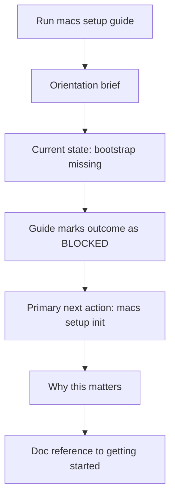
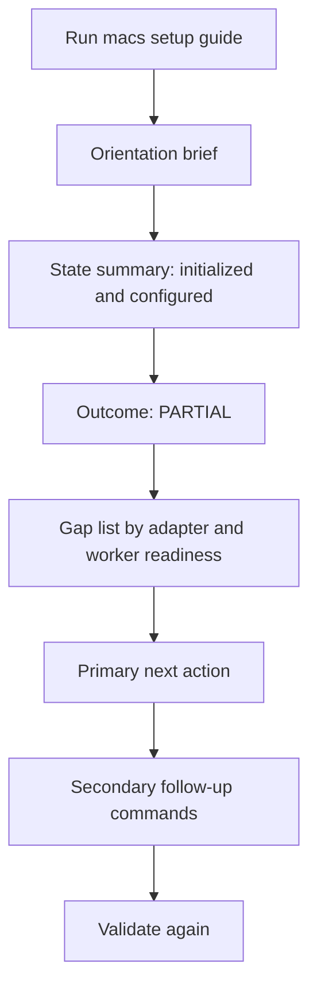
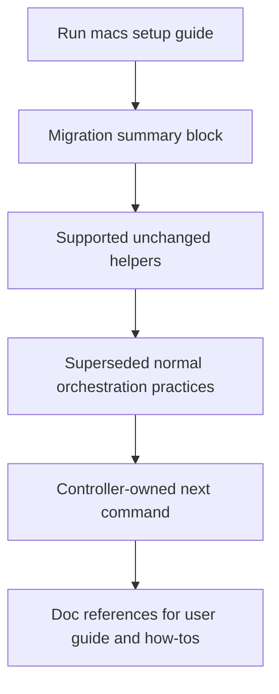
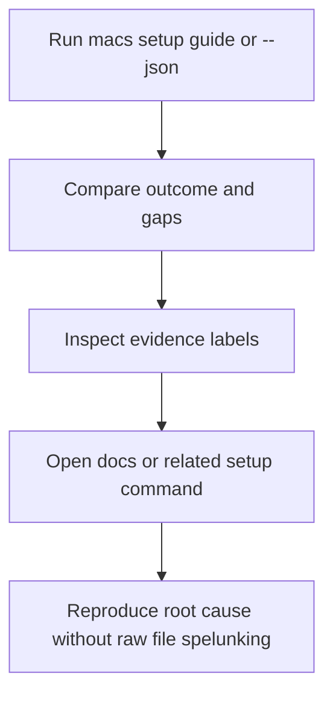

---
stepsCompleted:
  - step-01-init
  - step-02-discovery
  - step-03-core-experience
  - step-04-emotional-response
  - step-05-inspiration
  - step-06-design-system
  - step-07-defining-experience
  - step-08-visual-foundation
  - step-09-design-directions
  - step-10-user-journeys
  - step-11-component-strategy
  - step-12-ux-patterns
  - step-13-responsive-accessibility
  - step-14-complete
inputDocuments:
  - /home/codexuser/macs_dev/_bmad-output/planning-artifacts/prd-macs-guided-onboarding.md
  - /home/codexuser/macs_dev/_bmad-output/planning-artifacts/product-brief-macs-guided-onboarding.md
  - /home/codexuser/macs_dev/_bmad-output/planning-artifacts/product-brief-macs-guided-onboarding-distillate.md
  - /home/codexuser/macs_dev/_bmad-output/brainstorming/brainstorming-session-2026-04-14-11-00-57.md
  - /home/codexuser/macs_dev/_bmad-output/project-context.md
  - /home/codexuser/macs_dev/README.md
  - /home/codexuser/macs_dev/docs/getting-started.md
  - /home/codexuser/macs_dev/docs/user-guide.md
  - /home/codexuser/macs_dev/docs/how-tos.md
  - /home/codexuser/macs_dev/docs/contributor-guide.md
  - /home/codexuser/macs_dev/_bmad-output/planning-artifacts/operator-cli-contract.md
  - /home/codexuser/macs_dev/_bmad-output/planning-artifacts/ux-design-specification.md
  - /home/codexuser/macs_dev/_bmad-output/implementation-artifacts/stories/7-2-deliver-mixed-runtime-setup-and-validation-flow.md
workflowType: ux-design
lastStep: 14
status: complete
---

# UX Design Specification - MACS Guided Onboarding

**Author:** Dicky  
**Date:** 2026-04-14T11:24:00+01:00

---

## Executive Summary

### Project Vision

MACS guided onboarding should feel like a calm controller briefing, not a wizard. An operator should be able to run one setup-family command and immediately understand three things: what MACS is governing, what is true about the current repo right now, and what the safest next action is.

The experience must stay faithful to the implemented system. It is not a separate product surface and not a dashboard hiding controller state behind presentation. It is a terminal-native explanation layer over the existing `setup check`, `setup dry-run`, and `setup validate` seams.

### Target Users

Primary users are technically capable adopters who are comfortable in a shell but still need help translating MACS setup facts into confident next actions.

Secondary users are maintainers reproducing onboarding issues, validating brownfield repo state, or diagnosing why a repo is still `PARTIAL` or `BLOCKED`.

Tertiary users are contributors who need a single onboarding interaction model that stays aligned with current docs and setup-family contracts.

### Key Design Challenges

- Explain controller-owned truth without forcing operators to read the architecture first.
- Merge setup snapshot, conservative order, validation outcome, and migration guidance into one flow without creating duplicate semantics.
- Distinguish read-only inspection from state-changing commands every time a next step is shown.
- Keep the surface usable at 80 columns, in tmux panes, and with `NO_COLOR=1`.
- Show enough evidence to build trust without turning onboarding into a forensic dump.

### Design Opportunities

- Reuse current, already-shipping setup vocabulary and readiness outcomes instead of inventing onboarding-only terms.
- Make `PARTIAL` and `BLOCKED` actionable by tying each gap to the next safe command.
- Turn existing docs into a deliberate second layer: the guide explains what matters now, while docs provide the deeper model.
- Give maintainers and adopters the same operational language for support and reproduction.

## Core User Experience

### Defining Experience

The defining experience is a command-led onboarding briefing with this progression:

1. Explain the control model in one short operational summary.
2. Show the current onboarding state of the repo.
3. Name the main gaps or confirmations.
4. Recommend the next safe action and explain why.
5. Offer canonical docs and follow-up commands for deeper investigation.

The operator should feel like the controller has interpreted the repo for them, not like they are reading a tutorial detached from current state.

### Platform Strategy

The primary surface is a local CLI command under `macs setup`. It must work well in standard shells, tmux panes, SSH sessions, copied plain text, and scripted local workflows through `--json`.

There is no requirement for a browser UI or full-screen TUI in this initiative. Any future richer console should inherit the same guidance model rather than replace it.

### Effortless Interactions

The UX must make these interactions low-friction:

- launching guided onboarding from the existing setup family
- scanning current repo state in one screen
- understanding whether the next command is read-only or mutating
- copying the exact next command from the output
- seeing why a result is `PARTIAL`, `BLOCKED`, or `PASS`
- opening the right doc section only when deeper explanation is needed

### Critical Success Moments

The first critical moment is the first run in a not-yet-ready repo. The operator should immediately understand whether the repo is merely unbootstrapped, missing runtime availability, missing worker registration, or missing ready-worker evidence.

The second is the first `PARTIAL` result. The guide must explain why installed binaries alone do not equal safe-ready-state and must route the operator to the next exact command.

The third is brownfield migration clarity. Existing single-worker users should see what remains supported unchanged and what is now superseded by controller-owned setup and task commands.

### Experience Principles

- Truth before tutorial.
- Recommendation before verbosity.
- Read-only by default.
- Explicit action boundaries.
- Evidence close at hand.
- Canonical docs as the deep layer, not duplicated prose.

## Desired Emotional Response

### Primary Emotional Goals

The experience should create calm confidence, productive caution, and low ambiguity. Operators should feel helped, not handheld.

### Emotional Journey Mapping

At entry, the operator should move from uncertainty to orientation. During state interpretation, they should feel the repo has become legible. During remediation, they should feel guided but still in control. At safe-ready-state, they should feel confident enough to proceed into normal MACS workflows.

### Micro-Emotions

- reassurance when the guide distinguishes controller facts from runtime hints
- relief when the next safe step is obvious
- healthy skepticism when uncertainty or degraded evidence is labeled explicitly
- closure when migration boundaries are stated clearly instead of implied

### Design Implications

The tone should be operational and direct. The interface should not anthropomorphize MACS or simulate chat. Trust comes from clarity, stable structure, and obvious provenance for every recommendation.

### Emotional Design Principles

- Prefer composure over hand-holding.
- Use warnings to clarify risk, not to dramatize.
- Make readiness feel earned, not assumed.
- Treat ambiguity as something to expose, not smooth over.

## UX Pattern Analysis & Inspiration

### Inspiring Products Analysis

The most relevant inspirations are operational terminal tools rather than consumer onboarding flows:

- `git status` for concise state plus recommended action
- `systemctl status` for layered summary plus evidence
- `kubectl get` and `kubectl describe` for object truth before remediation
- `brew doctor` for gap-oriented remediation guidance

MACS should borrow their best shared trait: they tell the operator what is true, what is wrong, and what to run next without pretending to be a GUI.

### Transferable UX Patterns

- top-line status first, detail second
- fixed output order so operators build muscle memory
- short explanatory labels for state and severity
- action blocks that separate recommended commands from background notes
- explicit provenance markers such as controller fact, runtime hint, and doc reference

### Anti-Patterns to Avoid

- a chatty wizard that feels detached from the actual CLI
- hidden automation or implied auto-fix behavior
- over-wide pseudo-dashboards that break in tmux panes
- color-only meaning for warnings or outcomes
- long-form doc duplication inline with the main guidance path

### Design Inspiration Strategy

The design direction should combine dense operational summaries with lightweight explanation. The output should remain recognizably MACS, using current command names and control-plane language rather than onboarding-only metaphors.

## Design System Foundation

### 1.1 Design System Choice

The design system should be custom and terminal-native. It is a formatting and semantics system, not a component library in the browser sense.

### Rationale for Selection

MACS guided onboarding lives in the CLI, not on the web. The design system therefore needs to standardize:

- output ordering
- state labels
- severity language
- command emphasis
- spacing and grouping
- no-color fallbacks

### Implementation Approach

Use the existing text-first CLI rendering style as the base and add a reusable onboarding presentation pattern:

- orientation brief
- current-state summary
- gap list
- next-action block
- evidence or reference block

This should render consistently in human-readable form and map cleanly to a stable JSON envelope.

### Customization Strategy

Support two presentation modes without changing meaning:

- standard color-capable terminals using semantic colors for success, caution, and blocked states
- no-color or reduced-color environments using textual labels and spacing only

Customization should never change canonical nouns or command grammar.

## Defining Experience

### User Mental Model

The UX should teach this model:

- MACS controller facts are authoritative.
- Runtime binaries on `PATH` are only availability hints.
- Registered workers are not automatically ready workers.
- Safe-ready-state requires controller-visible evidence, not just installed tools.
- Guidance points to actions the operator must choose to run explicitly.

### Success Criteria

The UX succeeds when operators can answer these questions in a few seconds:

- Is this repo initialized and configured?
- What outcome does MACS currently assign to onboarding readiness?
- What is the highest-priority gap right now?
- Which command should I run next?
- Is that next command read-only or state-changing?
- Where can I read more if I need depth?

### Novel UX Patterns

This initiative introduces one distinctive MACS pattern: a state-aware onboarding briefing that composes three existing sources into one operator surface:

- setup snapshot
- conservative onboarding order
- readiness validation outcome

The novelty is not graphical. It is the controlled combination of already-authoritative facts into a guided decision surface.

### Experience Mechanics

Core mechanics for the guided flow:

- orient: explain the model in one concise block
- classify: summarize repo readiness and current phase
- diagnose: list current gaps with evidence source
- recommend: show the next safe command and why it matters
- deepen: link to the right docs or related commands

## Visual Design Foundation

### Color System

Color use should be semantic and optional:

- success: `PASS` and confirmed readiness
- caution: `PARTIAL`, migration notes, or incomplete setup
- blocked: `BLOCKED`, missing core dependencies, or missing authoritative evidence
- neutral: informational summaries and doc references

Every color meaning must also appear in plain text through explicit labels.

### Typography & Layout

Use the terminal’s existing monospace environment and keep layout simple:

- a one-line heading for the command context
- aligned key-value summaries near the top
- blank lines between output groups
- short bullet lists for gaps and next actions

Do not rely on Unicode box drawing or dense table borders for essential meaning.

### Information Hierarchy

The human-readable guide should always render in this order:

1. orientation
2. outcome and repo state
3. readiness gaps or confirmations
4. next safe action
5. related commands
6. canonical doc references

### Terminal-Specific Tokens

Recommended textual markers:

- `[READ-ONLY]`
- `[ACTION]`
- `[WHY]`
- `[DOC]`
- `[EVIDENCE]`
- `[MIGRATION]`

These markers preserve scanability when color is unavailable or when output is pasted into plain text.

## Design Direction Decision

### Design Directions Explored

Three viable directions were considered for the onboarding experience:

1. Linear tutorial transcript: easy to read but too detached from real repo state.
2. Dense diagnostic report: truthful but still leaves too much sequencing inference.
3. Command-led operational briefing: combines explanation, state, and next action without pretending to be a wizard.

### Chosen Direction

Choose the command-led operational briefing.

This direction keeps the guide inside the existing `macs setup` family, preserves operator agency, and stays compatible with current CLI rendering patterns.

### Design Rationale

The chosen direction is safest because it:

- reuses established MACS language
- works in narrow terminals
- respects read-only versus state-changing boundaries
- scales to support and automation needs
- avoids inventing a new interaction model that would later need reconciliation with the CLI

### Implementation Approach

Document the chosen direction in markdown and implement the experience through terminal output only. No HTML design-direction showcase is generated in this planning cycle because the initiative is intentionally planning-only and does not require code or mockup assets.

## User Journey Flows

### Journey 1: Fresh Repo, Not Yet Bootstrapped

The operator needs to understand that MACS cannot reason about readiness until repo-local setup exists.

### Journey 2: Repo Bootstrapped but Not Safe-Ready

The operator has some configuration but still lacks runtime availability, registered workers, or ready-worker evidence.

### Journey 3: Existing Single-Worker User Migrating

The operator needs clarity about what legacy habits remain valid and what is now superseded by controller-owned commands.

### Journey 4: Maintainer Diagnosing Another Operator's Failure

The maintainer needs a fast path from reported onboarding issue to reproducible controller facts.

### Journey Patterns

Common journey patterns that should remain consistent:

- every flow starts with orientation plus current state
- every non-pass state ends with a next action
- every state-changing recommendation is labeled explicitly
- every deeper explanation points to canonical docs rather than duplicating them inline

### Flow Optimization Principles

- Show the primary next command before optional follow-ups.
- Collapse theory into one short model summary.
- Keep each gap explanation to one operational sentence.
- Prefer one-screen comprehension over conversational turn-taking.

## Component Strategy

### Design System Components

Reusable terminal-native components already implied by current MACS output:

- key-value summary rows
- ordered command lists
- gap bullets
- reference command blocks
- migration note blocks

These should remain the foundation for the guided onboarding view.

### Custom Components

### Orientation Brief

**Purpose:** Explain what MACS is governing and why controller truth matters.  
**Usage:** Always shown near the start of guided onboarding.  
**Anatomy:** one short paragraph or two short bullets.  
**States:** default only.  
**Accessibility:** plain text, no decorative reliance.  
**Interaction Behavior:** none; this is informational context.

### Setup State Summary

**Purpose:** Show whether the repo is initialized, configured, partially ready, or safe-ready.  
**Usage:** Immediately after orientation.  
**Anatomy:** outcome label, safe-ready flag, enabled adapters, worker counts, routing-default visibility.  
**States:** pass, partial, blocked, fail.  
**Accessibility:** textual outcome labels required even in color mode.  
**Interaction Behavior:** supports copyable, plain-text summary.

### Conservative Step Ladder

**Purpose:** Show the onboarding order MACS expects.  
**Usage:** When the operator needs sequencing context.  
**Anatomy:** numbered steps, command, purpose, read-only flag.  
**States:** complete path, current-step emphasis, migration notes.  
**Accessibility:** must remain understandable when wrapped at 80 columns.

### Gap Explanation List

**Purpose:** Translate readiness failures into specific operational problems.  
**Usage:** For `PARTIAL`, `FAIL`, or `BLOCKED` states.  
**Anatomy:** gap message, category, affected adapter or worker scope, provenance.  
**States:** warning, blocked, informational.  
**Accessibility:** severity must appear in text, not just color.

### Next Action Card

**Purpose:** Promote the most important next operator action.  
**Usage:** Once per guided response, with optional secondary actions beneath it.  
**Anatomy:** action label, command, why it matters, read-only vs mutating marker.  
**States:** primary action, alternative action, no action needed.  
**Accessibility:** command remains copyable in plain text.

### Evidence & Doc Reference Block

**Purpose:** Give maintainers and advanced users the bridge from summary to source.  
**Usage:** Near the bottom of the flow.  
**Anatomy:** evidence source labels, related commands, doc paths or anchors.  
**States:** with or without doc refs depending on state.  
**Accessibility:** readable as plain text and stable in `--json`.

### Component Implementation Strategy

Build the guide from current setup-family output concepts rather than inventing a separate rendering stack. The custom components above should compose existing CLI patterns and should map cleanly to structured fields for tests and automation.

### Implementation Roadmap

**Phase 1 - Core Components**

- Orientation Brief
- Setup State Summary
- Next Action Card
- Gap Explanation List

**Phase 2 - Support Components**

- Conservative Step Ladder
- Evidence & Doc Reference Block
- Migration Summary block

**Phase 3 - Deferred Enhancements**

- resume or checkpoint affordances for longer onboarding
- richer overview-console reuse of the same view model

## UX Consistency Patterns

### Button Hierarchy

This CLI surface has no buttons, so action hierarchy must be expressed textually:

- one primary command recommendation
- zero or more secondary related commands
- one clear marker for read-only vs mutating actions

### Feedback Patterns

Use consistent textual feedback patterns:

- `Outcome:` for readiness classification
- `Gaps:` for blocking or partial issues
- `Next action:` for the primary recommendation
- `Related commands:` for optional follow-up
- `Docs:` for deeper reading

### Input & Command Patterns

Placeholder style must remain consistent:

- `<worker-id>`
- `<adapter-id>`
- `<task-id>`

Do not mix example placeholders with prose placeholders in the same output.

### Navigation Patterns

The navigation pattern is command-to-command, not screen-to-screen:

- guide to inspect state
- guide to follow the next command
- validate again to confirm readiness
- open docs only if the operator needs depth

### Additional Patterns

Other consistency rules:

- keep canonical nouns exactly as MACS uses them
- never use onboarding-only synonyms for `worker`, `adapter`, or `recovery`
- show migration notes in a dedicated block, not mixed into gap bullets
- keep doc references explicit and path-based

## Responsive Design & Accessibility

### Responsive Strategy

Responsiveness in this initiative means terminal-width adaptation, not device chrome.

- narrow mode: 80 columns or half-width tmux pane; stack all sections vertically
- standard mode: 81 to 119 columns; allow compact key-value summaries with short lists
- wide mode: 120 columns and above; allow slightly denser summaries, but keep the same section order

### Breakpoint Strategy

Use terminal-column breakpoints instead of pixel breakpoints:

- narrow: `<= 80`
- standard: `81-119`
- wide: `>= 120`

The guide should never require wide mode for comprehension.

### Accessibility Strategy

Target practical CLI accessibility equivalent to WCAG AA intent:

- no color-only meaning
- explicit textual state labels
- copyable commands
- plain-text compatibility for screen readers and pasted logs
- no hidden hover or mouse-dependent behavior

### Testing Strategy

Validate the UX in these conditions:

- standard color terminal
- `NO_COLOR=1`
- `COLUMNS=80`
- half-width tmux pane rendering
- `--json` output inspection for parity with human-readable guidance

### Implementation Guidelines

- Keep essential lines short enough to wrap cleanly.
- Use ASCII-first formatting for portability.
- Put the primary action close to the main outcome.
- Preserve the same information order in human and JSON modes.
- Treat doc references and evidence labels as first-class content, not afterthoughts.
