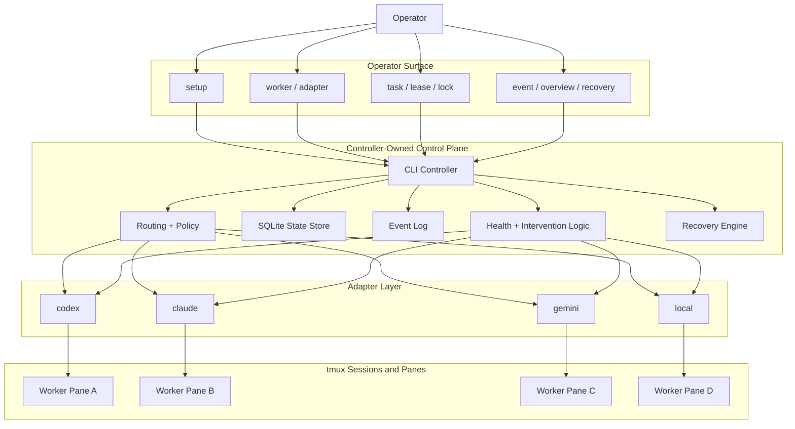
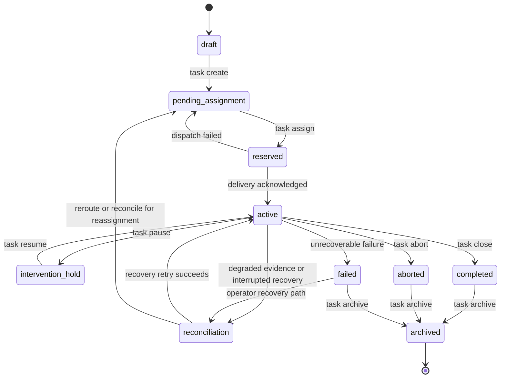
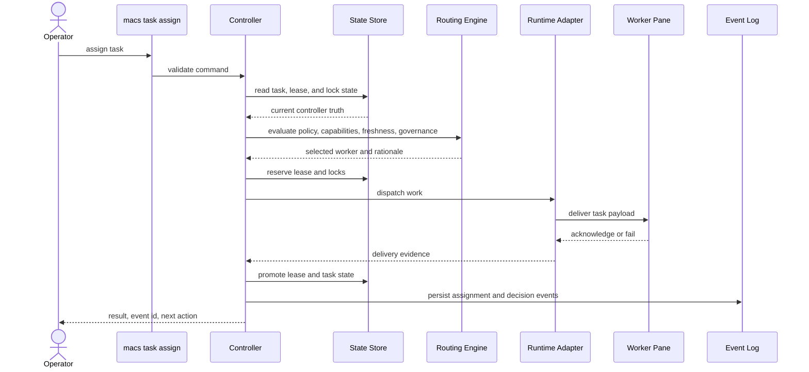
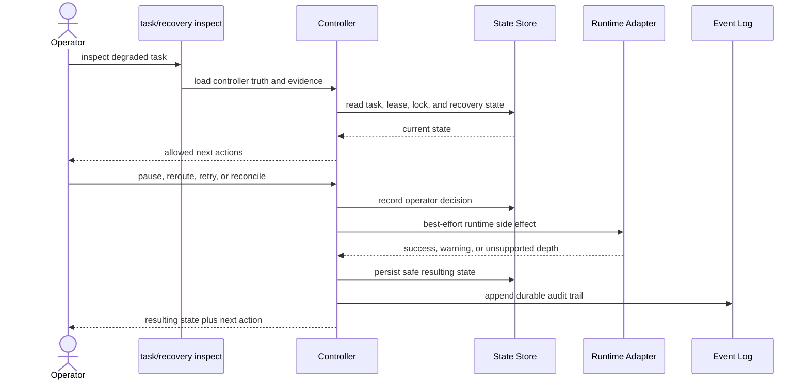

# MACS Architecture

This document explains the implemented MACS control plane. It is written for operators who want a reliable mental model and contributors who need to understand where authority, evidence, and recovery logic actually live.

## Controller-First Model

MACS is not just a tmux bridge. The bridge helpers still exist, but the implemented system is a controller-owned orchestration layer with durable state and explicit lifecycle rules.

The controller is authoritative for:

- `worker`
- `task`
- `lease`
- `lock`
- `event`
- `recovery` context

Runtime adapters provide evidence and execution hooks. They do not become the source of truth for routing, ownership, or audit history.

## Control Plane Overview

## Core Entities

| Entity | Authority | Why it exists |
| --- | --- | --- |
| `worker` | Controller | Tracks governed execution endpoints and current readiness |
| `task` | Controller | Holds the current unit of work and lifecycle state |
| `lease` | Controller | Records who owns a task now or who owned it previously |
| `lock` | Controller | Protects write-sensitive surfaces from unsafe overlap |
| `event` | Controller | Stores durable decisions, interventions, and state transitions |
| adapter evidence | Adapter | Supplies facts, signals, or claims with freshness context |

The safety rule that shapes the rest of the architecture is simple: a task may have zero or one live lease, never more than one.

## Task and Lease Lifecycle

The task surface and the lease surface move together, but they are not the same thing. A task describes work state. A lease describes ownership state.

This is why pause, reroute, abort, retry, and reconcile live on controller-owned command paths. They are not UI shortcuts over raw tmux actions. They are explicit lifecycle transitions with durable history.

## Assignment Flow

Assignment is evidence-backed and lock-aware. MACS does not treat "worker is present" as enough proof to route work safely.

## Intervention and Recovery Flow

Intervention and recovery are part of the normal control plane. They are not side channels.

## Storage and Evidence

Repo-local state lives under `.codex/orchestration/`.

| Path | Purpose |
| --- | --- |
| `controller.lock` | Exclusive controller lock for the repo-local session |
| `state.db` | Authoritative SQLite state store |
| `events.ndjson` | Append-friendly export of durable events |
| `controller-defaults.json` | Controller defaults such as task creation defaults |
| `adapter-settings.json` | Adapter enablement and config references |
| `routing-policy.json` | Workflow-aware routing defaults |
| `governance-policy.json` | Governed-surface and audit-content policy |
| `state-layout.json` | State-path map and compatibility references |

Compatibility files such as `.codex/tmux-session.txt`, `.codex/tmux-socket.txt`, and `.codex/target-pane.txt` still matter. They remain part of targeting behavior, but not part of authoritative orchestration state.

## Implementation Map

| Area | Primary files |
| --- | --- |
| CLI entrypoints | `tools/orchestration/cli/main.py`, `tools/orchestration/cli/rendering.py` |
| Setup and validation | `tools/orchestration/setup.py`, `tools/orchestration/config.py`, `tools/orchestration/session.py` |
| Task lifecycle | `tools/orchestration/tasks.py`, `tools/orchestration/interventions.py` |
| Routing and policy | `tools/orchestration/routing.py`, `tools/orchestration/policy.py` |
| Worker governance | `tools/orchestration/workers.py`, `tools/orchestration/health.py` |
| Recovery | `tools/orchestration/recovery.py` |
| Audit and history | `tools/orchestration/history.py`, `tools/orchestration/overview.py` |
| State and invariants | `tools/orchestration/store.py`, `tools/orchestration/invariants.py`, `tools/orchestration/state_machine.py` |
| Adapters | `tools/orchestration/adapters/` |
| Bridge helpers | `tools/tmux_bridge/` |

## What to Read Next

- [Using MACS](./user-guide.md) for the operator-facing command families
- [How-To Recipes](./how-tos.md) for step-by-step flows
- [Contributor Guide](./contributor-guide.md) for repo structure and validation
- [Adapter Contributor Guide](./adapter-contributor-guide.md) for runtime integration work
